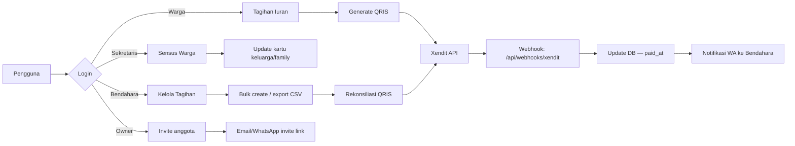

# Product Requirements Document — Smarthub V3

> Multi-tenant SaaS — manajemen komplek perumahan (RT/RW) dengan fullstack TypeScript (Bun + Hono + React)

## 🎯 Visi Produk

**Smarthub V3** adalah platform terintegrasi untuk pengelolaan perumahan/RT/RW: pencatatan warga, penagihan iuran, pembayaran QRIS, laporan keuangan, dan pelayanan berbasis WhatsApp (GoWA).

**Target pengguna**: RT/RW, manajer apartemen, pengelola perumahan, warga.

---

## 🏗️ Arsitektur Multi-Tenant (Layer Role)

| Layer | Role | Akses | Keterangan |
|---|---|---|---|
| **1 — Public** | Tamu / calon warga | ❌ ❌ ❌ ❌ ❌ | Landing page, CTA ke login |
| **2 — Warga** | `TENANT_USER` | 🟢 Warga, Tagihan (read-self) | Lihat tagihan, bayar QRIS, ajukan surat, profil kartu keluarga |
| **3 — Sekretaris** | `TENANT_SECRETARY` | 🟢 Semua Warga + Verifikasi, Sensus, Laporan (read-only) | Verifikasi pembayaran, input data sensus |
| **4 — Bendahara** | `TENANT_TREASURER` | 🟢 Semua Warga + Keuangan, Tagihan (manage), Laporan (read) | Kelola tagihan, export laporan, reconciled QRIS |
| **5 — Owner / Manager** | `TENANT_MANAGER` | ✅ Semua akses tenant | Full CRUD, invite anggota, settings, audit log |
| **6 — Superadmin** | `SUPERADMIN` | ✅ Semua tenant + system-wide | Kelola tenant list, billing, audit cross-tenant |
| **7 — Service API** | `API_SERVICE` | tergantung scope | Xendit webhook, GoWA webhook, scheduler |

> 🔐 Semua role Layer 2–5 dilindungi oleh **PostgreSQL Row-Level Security (RLS)** + **JWT scope middleware di Hono**.

---

## 🧩 Fitur — MVP vs Stretch

### 📌 MVP (Minimum Viable Product)
> Harus selesai sebelum demo ke pemilik. Scope: core tenant workflow.

| Kategori | Fitur | Detail | UI Layer | Est. |
|---|---|---|---|---|
| Auth | Register/Login | Email/WhatsApp, password reset flow | 1, 2 | 2d |
|  | Multi-tenant routing | Subdomain atau path-based: `/app/:tenantId/*` | — | 1d |
| Warga | Dashboard | Tagihan aktif (sudah jatuh tempo / belum) | 2 | 1d |
|  | Tagihan detail | Lihat tagihan periode, status (lunas/belum) | 2 | 1d |
|  | QRIS payment | Buat pembayaran QRIS → webhook Xendit | 2 | 2d |
|  | Ajukan surat | Form ajukan surat domisili/kependudukan | 2 | 1d |
| Sekretaris | Verifikasi Pembayaran | Konfirmasi / tolak pembayaran | 3 | 1d |
|  | Sensus warga | Input/edit data kartu keluarga, anggota keluarga | 3 | 2d |
| Bendahara | Kelola Tagihan | Buat tagihan manual, bulk import | 4 | 1d |
|  | Rekonsiliasi QRIS | Match pembayaran dengan laporan Xendit | 4 | 2d |
|  | Export Laporan | CSV / Excel — laporan keuangan, sensus | 4 | 1d |
| Owner | Dashboard tenant | Ringkasan tagihan, pembayaran, warga aktif | 5 | 1d |
|  | Invite anggota tim | Scope: full | ops | 1d |
|  | Settings | Nama komplek, logo, warna tema, NIB/NPWP | 5 | 1d |
| System | Health check | `/api/health` → DB, Redis, MinIO | — | 0.5d |
|  | Audit log | Semua aksi login, write → log | 5 | 1d |

**Estimasi MVP: ~20 hari dev** (paralel per layer, dengan testing)

---

### 🧪 Stretch (setelah MVP)
| Kategori | Fitur | Detail | Prioritas |
|---|---|---|---|
| Real-time | Notifikasi live | WebSocket → refresh tagihan/pembayaran real-time | Medium |
|  | GoWA otomatis | Notifikasi WhatsApp ke warga (tagihan baru, tagihan jatuh tempo) | Medium |
|  | Chatbot WhatsApp | Bot jawab FAQ warga otomatis | Low |
| Reporting | Dashboard analitik | Grafik pembayaran, partisipasi, keterlambatan | Medium |
|  | Export PDF | Invoice/resi pembayaran, laporan bulanan | Medium |
| Advanced | Sistem pengumuman | Feed berita khusus tenant | Low |
|  | Integrasi pihut | Notifikasi ke RT/RW via email | Low |
|  | Mobile app | React Native / Expo (Android only) | Low |

---

## 📊 Data Flow (MVP)



---

## 🔌 API Endpoints (MVP)

### Auth / Profile
```
POST   /api/auth/login
POST   /api/auth/login-whatsapp
POST   /api/auth/reset-password-request
POST   /api/auth/reset-password
GET    /api/me
GET    /api/tenants/:id/settings
```

### Warga
```
GET    /api/billing/invoices              # list tagihan aktif
GET    /api/billing/invoices/:id          # detail tagihan
POST   /api/bapi_billing/invoices/:id/pay # generate QRIS
GET    /api/billing/invoices/:id/receipt  # PDF receipt
POST   /api/surat                         # ajukan surat
```

### Sekretaris
```
GET    /api/census/households             # list kartu keluarga
POST   /api/census/households             # tambah kartu keluarga
PUT    /api/census/households/:id         # edit
GET    /api/payments/unverified           # list pembayaran perlu verifikasi
POST   /api/payments/verify               # konfirmasi
```

### Bendahara
```
POST   /api/billing/invoices/bulk         # bulk create tagihan
GET    /api/reports/keuangan              # laporan keuangan
GET    /api/reports/exports               # export CSV
POST   /api/reconcile/qris                # rekonsiliasi QRIS
```

### Owner
```
POST   /api/teams/invite                  # undang anggota team
GET    /api/audit-log                     # lihat audit log tenant
PUT    /api/settings                      # update settings
```

### Superadmin
```
GET    /api/superadmin/tenants            # list semua tenant
POST   /api/superadmin/tenants            # buat tenant baru
GET    /api/superadmin/audit              # audit cross-tenant
```

### Service / Webhook
```
POST   /api/webhooks/xendit               # webhook pembayaran
POST   /api/webhooks/gowa                 # webhook WhatsApp
GET    /api/health                        # health check
```

> 💡 Semua endpoint di Layer 2–5 wajib lewat **JWT middleware** + **RLS query** (tenant_id otomatis di WHERE clause).

---

## 🧱 Database Schema (MVP tables)

> PostgreSQL 16 — semua table punya kolom `tenant_id` dan query lewat RLS.

```sql
-- Tenants (perumahan/RT/RW)
tenants (id, name, slug, status, settings JSONB, created_at)

-- Users (warga + staff)
users (id, tenant_id, email, phone, password_hash, name, role, status)

-- Households (kartu keluarga)
households (id, tenant_id, nomor_kk, kepala_keluarga_id)

-- Family members
family_members (id, household_id, nik, name, relation, phone, email)

-- Billing
invoices (id, tenant_id, household_id, period, amount, due_date, paid_at, status)

-- Payments (QRIS)
payments (id, invoice_id, provider_ref, amount, status, expired_at)

-- Audit log
audit_logs (id, tenant_id, user_id, action, detail, ip, created_at)
```

---

## 🔐 Security & Compliance

- **RLS mandatory** — semua query DB wajib include `tenant_id` di WHERE
- **Rate limiter login** — maks 5 attempt/IP/15menit → block
- **Audit trail** — semua aksi `POST / PUT / DELETE` wajib log
- **PII encryption** — NIK/password tidak pernah simpan plaintext
- **JWT scope** — role-based access control via JWT claim
- **GoWA webhook verification** — signature validation mandatory
- **Xendit webhook verification** — signature + idempotency key
- **Backup** — PostgreSQL dump harian 02:30 → `/var/backups/mysql/` + off-site B2

---

## 🧪 Testing Strategy

| Layer | Framework | Fokus |
|---|---|---|
| Backend unit | Bun test | Hono handlers, usecases, middleware |
| API integration | Bun test | Endpoint-to-DB query + auth flow |
| UI unit | React Testing Library | Component render, props validation |
| UI E2E | Playwright | Login flow, QRIS payment, export CSV |
| Security | OWASP ZAP | Scan tiap sprint |
| Deploy | curl live | Health check + status HTTP 200 |

---

## 📈 Sprint Plan (staged — bisa dieksekusi mandiri)

| Sprint | Fokus | Durasi | Output |
|---|---|---|---|
| **Sprint 1** | Infra + Auth | 3-4 hari | Docker compose, Hono skeleton, login flow, tenant routing |
| **Sprint 2** | Warga (Tagihan + QRIS) | 4-5 hari | Dashboard, tagihan detail, QRIS payment ke Xendit |
| **Sprint 3** | Sekretaris + Bendahara | 5-6 hari | Verifikasi, sensus, kelola tagihan, export CSV |
| **Sprint 4** | Owner + Superadmin | 3-4 hari | Invite tim, settings, audit log, superadmin panel |
| **Sprint 5** | Testing + Deploy | 2-3 hari | Playwright E2E, security scan, produksi |
| **Sprint 6** | Stretch (WA bot, mobile) | - | Notifikasi real-time, mobile-ready |

---

## 🗓️ Timeline

- **MVP → demo pemilik**: Sprint 1–4 (~14–18 hari)
- **Production deploy**: Sprint 5
- **Stretch features**: Sprint 6 (post-launch)

---

## 📌 Glossary

| Istilah | Definisi |
|---|---|
| Tenant | Perumahan/RT/RW (isolasi data) |
| Warga | User role Level 2 — resident |
| Sekretaris | Staff role — verifikasi + sensus |
| Bendahara | Staff role — keuangan + tagihan |
| SPU | Service Point Unit (tempat kaca film) — ref: task lain |
| QRIS | Pembayaran via QR code (via Xendit) |
| GoWA | WhatsApp gateway (mg001 = 6289530854594) |
| RLS | Row-Level Security (PostgreSQL) |

---

## 🚧 Constraints & Dependencies

- Login Xendit/Biteship/GoWA dilakukan pemilik (E2E butuh kredensial)
- DNS: `smarthub.logikraf.id` → Cloudflare (DNS-only, no token di VPS)
- SSL: Let's Encrypt (auto-renew via acme.sh)
- Backup sudah ada — gunakan `/usr/local/bin/mysql-backup.sh`
- Jangan deploy manual di VPS — hanya GitHub Actions
